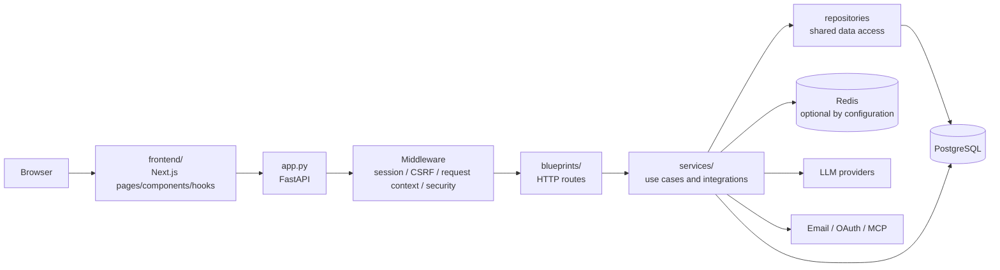

# Chat-Core-AI 内部アーキテクチャ

この文書は、Codex が変更箇所を特定するための内部設計の正本です。公開向けの概要・起動手順は `README.md`、利用者向けの操作説明は `docs/manual/`、CSS の詳細は `frontend/STYLING_STRATEGY.md` を参照してください。

## 1. システムの境界

ブラウザから利用する Next.js アプリと、FastAPI が提供する API・認証・バックグラウンド処理で構成されます。永続データは PostgreSQL、セッション・キャッシュ・ワーカー間の協調には設定時の Redis を使います。LLM、メール、OAuth、MCP は外部境界です。



### 正本と補助資料

| 情報 | 正本 | 変更時の参照先 |
| --- | --- | --- |
| HTTP のリクエスト／レスポンスモデル | `services/request_models.py`, `services/response_models.py` | `docs/knowledge/contracts-and-migrations.md` |
| フロントエンド用の生成済み契約 | `frontend/types/generated/api_schemas.ts`（生成物） | `scripts/generate_frontend_zod_schemas.py` |
| DB スキーマの変更履歴 | `alembic/versions/` | `docs/knowledge/contracts-and-migrations.md` |
| プロンプト添付画像の処理・保存境界 | `services/prompt_attachment_processing.py`, `services/prompt_attachment_storage.py` | `docs/architecture/prompt_attachment_storage.md` |
| フロントエンドの CSS 規約 | `frontend/STYLING_STRATEGY.md` と `frontend/public/static/css/` | UI 変更時に同文書を確認 |
| 技術判断の理由 | `docs/decisions/` | 既存 ADR を更新または新規 ADR を追加 |

### 構造の詳細マップ

全体像を確認した後、必要な領域だけ次の文書を開きます。

- [Frontend feature map](docs/architecture/frontend_feature_map.md): ページ、主要コンポーネント、hook、API 呼び出しの対応。
- [Backend route map](docs/architecture/backend_route_map.md): `app.py` が登録する router、URL 接頭辞、機能別ハンドラの対応。
- [Data model](docs/architecture/data_model.md): PostgreSQL の主要エンティティ、関連、Redis／ファイル保存との境界。
- [Deployment and operations](docs/architecture/deployment_and_operations.md): Docker Compose、Blue/Green、起動順、ポート、ボリューム、healthcheck。
- [Testing map](docs/architecture/testing_map.md): Backend／Frontend のテスト配置と機能別の選び方。
- [Prompt attachment storage](docs/architecture/prompt_attachment_storage.md): 添付画像処理と保存契約の詳細。

## 2. バックエンドの起動と構成

### `app.py` の責務

`app.py` はアプリケーションの composition root です。機能ロジックを追加する場所ではありません。主な起動順序は次のとおりです。

1. 環境設定を読み込み、ロギングを設定し、セッション署名キーを検証する。
2. `FastAPI` インスタンスと、認証制限・LLM 日次制限・チャット生成サービスを `app.state` に登録する。
3. セッション、ロケール、リクエストコンテキスト、セキュリティヘッダー、リクエストサイズ制限のミドルウェアを登録する。
4. `blueprints/` の各 `APIRouter` を登録する。
5. lifespan で初期データのシード、エフェメラルデータ／添付ファイルの定期クリーンアップ、MCP のライフサイクル、終了時のジョブ・DB プール停止を管理する。

ヘルスチェックは `GET /healthz`（プロセスの生存）と `GET /readyz`（依存先を含む準備状態）で分かれています。デバッグ時にこの二つを同じ意味として扱わないでください。

### レイヤーの責務

- `blueprints/`: HTTP のルート、認証・CSRF の境界、入力の受け取り、レスポンスへの変換を担当します。チャット、プロンプト共有、メモ、コンテキスト金庫、管理、認証を機能単位に分割しています。
- `services/`: 複数のルートから使う業務処理、外部連携、共通エラー、セキュリティ、キャッシュ、バックグラウンド処理を担当します。ルートから直接呼ぶ必要がある場合も、処理をサービスへ寄せてハンドラを薄く保ちます。
- `services/repositories/`: 複数機能で共有する DB アクセスの配置先です。既存コードには機能配下のデータアクセス（例: `blueprints/memo/repository.py`）もあるため、移動を目的にした大規模リファクタリングは行わず、新規の共有アクセスからこの境界を優先します。
- `services/repositories/auth_identity_repository.py`: メール・Google・Passkey認証が参照するユーザーと認証プロバイダーの専用永続化境界です。一般ユーザー機能のRepositoryへ認証情報の読み書きを追加しません。
- `services/request_models.py` / `services/response_models.py`: API 契約を定義します。フロントエンドの型を手書きで先行変更しないでください。
- `services/api_errors.py` / `services/error_messages.py`: API エラーの型と利用者向け文言を集約します。
- `services/csrf.py`: 状態変更リクエストに対する CSRF 検証の共通境界です。ルートごとに独自実装を増やしません。

### ルーターの主な対応表

| パッケージ | 主な範囲 | 代表的な URL の接頭辞 |
| --- | --- | --- |
| `blueprints/auth*.py`, `verification.py`, `auth_passkeys.py` | メール・Google・Passkey 認証 | `/api/auth`, `/oauth`, `/api/passkeys` |
| `blueprints/chat/` | チャット、部屋、タスク、プロフィール、設定、プロジェクト | `/api` |
| `blueprints/prompt_share/` | 公開プロンプト、検索、管理、メディア | `/prompt_share`, `/prompt_manage`, `/search` |
| `blueprints/memo/` | メモ、コレクション、共有、エクスポート | `/memo` |
| `blueprints/context_vault/` | パーソナル・コンテキストと候補の承認 | `/api/context-facts` |
| `blueprints/admin/` | 管理画面と管理 API | `/admin` |
| `blueprints/mcp_oauth.py` | MCP OAuth クライアント・接続管理 | `/api/mcp/oauth` |

状態を変更するルートは既存ルーターの依存関係と同様に CSRF を適用し、認証・所有者確認・レート制限をルートまたはサービスの適切な境界で行います。

## 3. データ、セッション、外部連携

### PostgreSQL とマイグレーション

`services/db.py` はワーカーごとにSQLAlchemy 2.0の`AsyncEngine`と`async_sessionmaker`を遅延生成します。Repositoryは`AsyncSession`を受け取り、Serviceがtransaction境界を管理します。通常のCRUDはORM、検索・CTE・JSONB・pgvector・PostgreSQL固有処理はSQLAlchemy Coreまたは`text()`を使います。`AsyncSession`は並列Task間で共有しません。認証プロバイダー情報の正本は`user_auth_providers`であり、`users`へプロバイダー列を重複保存しません。この契約は認証専用RepositoryとそのSQL契約テストで固定します。

スキーマ変更は Alembic の新しい revision として追加します。適用済み revision の書き換えや、アプリ起動時だけの暗黙の ALTER は行いません。インデックスだけの直接 SQL フォールバックとして `db/performance_indexes.sql` が存在しますが、通常のスキーマ履歴の代替ではありません。

### Redis の役割

Redis は設定されている環境で次の用途に使われます。

- セッション本体（`session:<id>`）の保存。ブラウザ Cookie には署名された Redis 参照 ID だけを保持します。
- Google OAuth の短命トランザクション（`google_oauth_transaction:<state>`）の保存。state、PKCE verifier、redirect URI、遷移先を一般セッションから分離し、コールバック時に `GETDEL` で一度だけ消費します。
- メール認証の短命トランザクション（`email_auth_transaction:<id>`）の保存。ログイン・新規登録のコード、対象ユーザー、試行回数を一般セッションから分離し、専用HttpOnly CookieとRedisの楽観的排他で検証します。コードはdigestで保存し、成功・期限切れ・試行回数上限で一度だけ消費します。
- キャッシュ、日次・月次制限、シングルフライトロック。
- 複数ワーカーをまたぐチャット生成イベント、停止通知、再接続用の協調。

Redis 障害時の扱いは用途ごとに異なります。一般キャッシュの未ヒットやシングルフライトのフェイルオープンは可能ですが、セッション本体、Google OAuth、メール認証トランザクションは安全側へ倒します。OAuth・メール認証の開始時にトランザクションを保存できなければ外部サービスへ遷移せず、メール認証コードを一般セッションやCookieへ書き込みません。セッション保存に失敗した場合も機密値をCookieへ書き込まず、必要に応じて再認証させます。通常のセッション更新は読み込み時の内容との楽観的排他を行い、古いリクエストの全体スナップショット書き戻しを拒否します。ログイン ID は認証成功時にローテーションされます。

### チャット生成と SSE

チャットの生成は HTTP ハンドラ内で LLM 呼び出しを完了させるのではなく、`services/chat_generation.py` の `ChatGenerationService`／`ChatGenerationJob` に委譲します。

1. `blueprints/chat/messages.py` が入力、部屋の所有権、制限、参照コンテキストを検証してジョブを開始する。
2. バックグラウンド実行器上のジョブが `services/llm.py` のプロバイダ抽象化を通じてストリームを読む。
3. ジョブはイベントに連番を付け、接続中の SSE に通知し、必要に応じて Redis のリプレイ／協調機能を使う。
4. フロントエンドは `/api/chat_generation_stream` などの SSE エンドポイントを購読し、切断時はステータス確認と再接続を行う。
5. 応答の永続化はジョブの終了・停止経路で一度だけ行います。途中停止でも生成済みの本文を扱うため、完了と停止の二重保存を追加しないでください。

LLM のストリーム終了理由が出力上限の場合は成功完了として扱いません。回答を書いた判断ステップが出力上限で切れたときは、`services/chat_answer_continuation.py` が表示済みの生本文を assistant 履歴として渡す限定回数の継続生成を行い、境界重複を除去します。継続は別フェーズではなく同じ回答の続きであり、モデルへ渡すのは判断ループが使ったのと同じ要求です。継続が最初から書き直した場合は既存本文の末尾を錨に接合し、接合できないパスは破棄します。正常終了しても新しい本文が増えない継続は `incomplete` として扱います。検索トレースなどの表示装飾と内部の状態更新封筒は継続入力にも表示本文にも含めません。継続上限後も本文がある場合は一度だけ保存し、終端イベント `incomplete` で部分回答であることを明示します。本文のない失敗は従来どおり `error` です。ツール呼び出しの有無が確定するまで判断ステップは試行全体をバッファするため、一時障害時に途中出力を破棄して先頭から安全に再試行できます。プロバイダが自前の見積もりより厳しく入力超過を返した場合は、同じ要求を送り直さず、生のツール結果を落とした `TurnState` だけの最小要求で同じ判断を1度だけやり直します。

SSE は通常イベントの連番と Redis リプレイ契約を維持しつつ、待機中だけイベント ID のないコメント keepalive を送ります。`done`、`aborted`、`error`、`incomplete` が終端イベントです。Nginx は開始・再生成・編集再生成・再接続の4経路すべてで buffering を無効化します。

通常チャットの検索を伴うターンは、`services/research_state.py` の単一の `TurnState` を意味状態の正本として扱います。`TurnState` には目的、未解決事項、得られた事実、出典、実行済み検索をまとめ、`step_notes` や `research_summary` のような並行する内部状態を持ちません。状態更新は文字数で先頭・末尾を切る処理ではありません。検索結果を受け取ったモデルが、質問への回答に必要な新しい事実、既存事実の修正、なお不明な点を判断し、根拠との対応を保って `TurnState` へ統合します。

`services/chat_generation.py` が「`TurnState` をモデルへ渡す → モデルが回答または検索を選ぶ → 検索結果をプロンプト外の Evidence として保持する → モデルが `TurnState` を更新する → 再判断する」という1本のループを所有します。事前の検索 Planner、調査後だけを扱う Wrapup、別 Summary 生成は置きません。検索要否とクエリは回答を生成するメインモデル自身が判断します。ループの終了条件は、モデルが現在の状態で回答可能と判断した場合、または検索実行回数が設定上限へ達した場合だけです。上限到達時は、モデルがその時点の `TurnState` と参照可能な Evidence から、不確実性を明示して回答します。

検索結果の全文と元のツール結果は、`services/chat_evidence_store.py` の `EvidenceStore` がターン内に保持し、`TurnState` の外かつプロンプト外へ置きます。次の判断には原則として更新済みの `TurnState` と直近のツール結果だけを渡し、生の検索履歴を毎回再送しません。詳細が再び必要になった場合は、モデルが `get_evidence` ツールへ evidence ID を渡して再取得できます。再取得もプロンプトへ載るため、検索結果と同じ根拠予算で抑え、超える場合は ID を残したまま本文から落として `evidence_truncated` を返します。検索根拠を持つターンには、引用 marker と回答方針を定める system 指示（`build_web_search_evidence_policy_message`）を1つだけ添えます。指示は根拠本文を含まず、根拠はツール結果と Evidence ストアだけが運びます。`TurnState` の出典は引用解決に必要な evidence ID と出典情報を保持し、コンテキスト予算が厳しい場合も文字列の機械的切り捨てではなく、モデルによる状態更新と必要な Evidence の再取得で対処します。

モデル／プロバイダ差は `services/llm.py` と `services/llm_tool_schema.py` の薄い Adapter 境界へ閉じ込めます。Adapter が吸収するのはツール呼び出し形式、ストリームイベント、出力上限などの最低限の差だけです。Qwen を含む特定モデル向けに検索 Planner、独自のまとめフェーズ、別の状態機械、別プロンプトによるワークフローを追加しません。この判断の理由と旧調査フローからの移行境界は [ADR 0009](docs/decisions/0009-single-turn-state-chat-loop.md) にあります。

LLM へ渡すツール定義は `services/llm_tool_schema.py` がプロバイダ境界で緩めます。プロバイダによってはモデルが返したツール引数をサーバー側で JSON Schema 検証し、違反を再試行不可のエラーとして返すため、`enum`・`required`・`additionalProperties: false` はそのまま渡しません。許可値と必須項目は説明文へ移し、値の検証と正規化はツール実行側（`services/chat_generation.py` と `services/web_search.py`）が担います。それでもプロバイダがツール呼び出しを拒否した場合は `LlmToolSchemaError` として分類し、同じステップをツールなしで1度だけやり直します。詳細と理由は [ADR 0008](docs/decisions/0008-provider-safe-tool-schemas.md) にあります。

`frontend/lib/chat_page/api_contract.ts` は、レガシー応答や生成 UI パーツを画面で安全に扱うための正規化層です。API の構造を変更する場合は、バックエンドモデル、生成スキーマ、必要な正規化処理を同時に確認します。

### 添付ファイル

プロンプト共有の画像は、処理（デコード、ピクセル数・アニメーション制限、EXIF 向き、メタデータ除去）と保存先を分離しています。保存契約や将来のオブジェクトストレージ移行条件は `docs/architecture/prompt_attachment_storage.md` に集約されています。この文書へ詳細を複製しません。

## 4. フロントエンドの構成

- `frontend/pages/`: Next.js Pages Router のページエントリーポイント。ページ単位のデータ取得と画面構成を担当します。
- `frontend/components/`: 機能単位・共通 UI の React コンポーネント。チャット、メモ、プロンプト共有、設定、認証などに分かれています。
- `frontend/hooks/` と `frontend/contexts/`: 複数コンポーネントで共有する状態・副作用・画面フローを担当します。チャットページの巨大なフローは用途別 hook に分割されています。
- `frontend/lib/`: API 呼び出し、SWR、レスポンス正規化、i18n、ストリーム処理などの再利用ロジックです。読み取りは `swrFetcher`、一般リクエストは `resilientFetch` の既存パターンを優先します。
- `frontend/scripts/`: ブラウザ側の共通ランタイム（CSRF、テーマ、再試行付き fetch など）です。
- `frontend/public/` と `frontend/styles/`: 静的 CSS、ページ・コンポーネント用 CSS、互換スタイルを配置します。トークンと CSS の責務分割は `frontend/STYLING_STRATEGY.md` が正本です。
- `frontend/types/generated/api_schemas.ts`: バックエンド Pydantic モデルから生成されるファイルです。直接編集しません。

### 共通コピーボタン

すべてのコピーボタンは1つの共通実装に集約しています。個別に copy 処理やタイマー、アイコン差し替えを書きません。

- `frontend/components/ui/copy_button.tsx`（`CopyButton`）: アイコンのみ（ラベル文字なし）のボタン描画。文字列コピーは `getText`、副作用（トースト・共有URL生成など）を伴う場合は成否を `boolean` で返す `onCopy` を渡します。
- `frontend/hooks/use_copy_feedback.ts`（`useCopyFeedback`）: コピー実行・二重実行防止・状態遷移（`idle`/`copied`/`error`）を担う土台。`CopyButton` から利用します。
- `frontend/lib/copy_feedback.ts`: React 非依存の共有定数（成功時にチェックマークを見せる時間、アイコンのクラス名）。本文中のコピーボタン（`frontend/scripts/chat/message_copy_buttons.ts`、`frontend/hooks/chat_page/use_home_page_controller.ts` のコードブロック用委譲）はこの定数を共有します。

挙動の統一仕様: 押すと数秒だけアイコンがチェックマーク（`bi-check-lg`）に変わり、その後元へ戻ります。

### 共有リンクと取り込み操作

共有URLの発行・取得・キャッシュはチャット、メモ、プロンプトの各機能が担当します。チャットはルーム単位の無期限トークン、メモは期限・失効可能なトークン、プロンプトは公開IDのパーマリンクであり、これらの保存・ライフサイクルは統合しません。公開パス、トークン衝突再試行、メモ共有状態のシリアライズだけをBackendの共有基盤で共有します。

Frontendでは、SNS（X・LINE・Facebook）URL生成、Web Share API、対応状況判定、共有モーダル本文（URL欄・コピー・SNS・端末共有）を共通部品へ集約します。URLが準備できるまでは共有先を操作できません。共有Chatのforkと公開プロンプトのTask／Skill取り込みは別のBackend use caseとして残し、Frontendのpending・success・error・二重実行防止・ボタン外観だけを共通契約にします。

### API 契約の同期

バックエンドの request/response model を変更したら、リポジトリルートまたは `frontend/` から次を実行して生成物を更新します。

```sh
npm --prefix frontend run generate:api-schemas
```

生成後は変更範囲に応じて `npm --prefix frontend run typecheck` と対象テストを実行します。詳細な失敗パターンは `docs/knowledge/contracts-and-migrations.md` にあります。

## 5. 変更時のナビゲーション

| 変更したいもの | 最初に見る場所 | 併せて確認するもの |
| --- | --- | --- |
| API の入出力 | 対応する `blueprints/` と `services/*_models.py` | 生成 Zod、フロントの API 正規化、ルートテスト |
| チャットの生成・停止・再接続 | `services/chat_generation.py` | `services/chat_turn_state.py`、`services/research_state.py`、`services/chat_evidence_store.py`、`blueprints/chat/messages.py`、`frontend/hooks/chat_page/`、SSE テスト |
| 認証・セッション・CSRF | `blueprints/auth*`、`services/repositories/auth_identity_repository.py`、`services/session_middleware.py`、`services/csrf.py` | `user_auth_providers`契約、Redis の設定、セキュリティテスト、ログイン後の ID ローテーション |
| 永続データ | 対応サービス／リポジトリ | 新規 Alembic revision、所有者確認、対象 DB テスト |
| プロンプト画像 | `services/prompt_attachment_processing.py` と storage | `docs/architecture/prompt_attachment_storage.md`、添付テスト |
| UI と CSS | 対応 `pages/`・`components/` | `frontend/STYLING_STRATEGY.md`、typecheck、対象 component test |
| 既知の障害やデバッグ | — | `docs/knowledge/debugging.md` |
| 技術判断の変更 | — | `docs/decisions/README.md` と該当 ADR |

変更を始める前に、依存する契約と永続化境界を特定し、関係ないレイヤーの整理を同じ変更に混ぜないでください。
