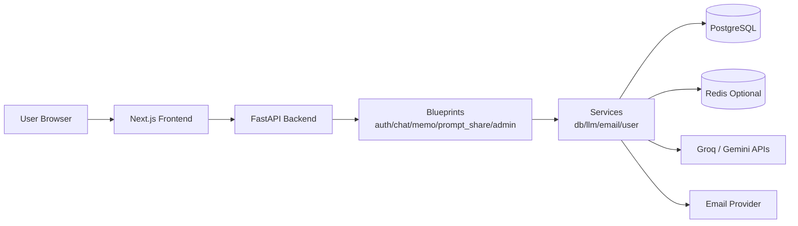
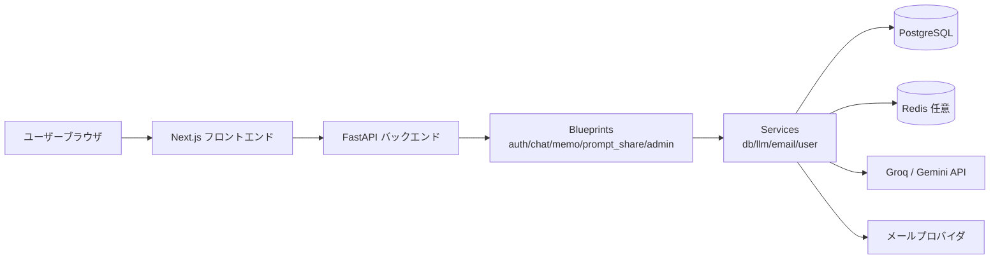

> 一番下に日本語版もあります

# ChatCore-AI


**🚀 Live Demo: [https://chatcore-ai.com/](https://chatcore-ai.com/)**

## UI Preview


## 🎬 Demo Videos

Click a thumbnail to open the video on YouTube.

<p align="center">
  <a href="https://youtu.be/tdPZJdZfeQ0" target="_blank" rel="noopener noreferrer">
    
  </a>
  <br>
  <sub><b>▶ Watch Demo Video</b></sub>
</p>

## Overview
Chat-Core-AI is a FastAPI-based AI chat application with email-based authentication, persistent + ephemeral conversations, and prompt sharing. It integrates with Groq and Google Gemini APIs, uses PostgreSQL for storage, and ships with a Next.js frontend.

## Key Features
- **Email-based authentication** with 6‑digit verification codes
- **Persistent + ephemeral chat** modes
- **Prompt sharing** with search and public visibility controls
- **Groq / Gemini integrations** for LLM responses

## Tech Stack
- **Backend**: Python 3.12, FastAPI, SQLAlchemy, Alembic
- **Frontend**: Next.js 14, React 18, TypeScript, Tailwind CSS
- **Database / Cache**: PostgreSQL 15, Redis 7 (optional)
- **LLM Providers**: Groq, Google Gemini
- **Local Dev**: Docker Compose

## Quick Start (Docker Compose)
> This project standardizes local execution on Docker Compose.

```sh
# 1) Clone the repository
git clone https://github.com/kota-kawa/Chat-Core.git
cd Chat-Core

# 2) Create a .env file with required environment variables
# Example:
# GROQ_API_KEY=xxxxx
# Gemini_API_KEY=xxxxx
# FASTAPI_SECRET_KEY=xxxxx
# SEND_ADDRESS=example@gmail.com
# SEND_PASSWORD=app_password
# GOOGLE_CLIENT_ID=xxxxx
# GOOGLE_CLIENT_SECRET=xxxxx
# GOOGLE_REDIRECT_URI=https://chatcore-ai.com/google-callback
# ADMIN_PASSWORD_HASH=pbkdf2_sha256$...
# POSTGRES_HOST=db
# POSTGRES_USER=postgres
# POSTGRES_PASSWORD=postgres
# POSTGRES_DB=strike_chat
# FRONTEND_URL=http://localhost:3000

# 3) Build and run
docker-compose up --build
```

- Frontend: `http://localhost:3000`
- API: `http://localhost:5004`

## Database Migrations (Alembic)
For existing environments, apply incremental DB changes with Alembic:

```sh
# Install dependencies first
pip install -r requirements.txt

# Apply all migrations
alembic upgrade head
```

- `db/init.sql` remains the bootstrap schema for brand-new databases.
- Default task definitions are centralized in `frontend/data/default_tasks.json` and seeded on startup.
- `alembic/versions/` contains incremental migration history.
- `db/performance_indexes.sql` is kept as a direct SQL fallback for index-only updates.

## Challenges & Solutions

**Redis session fallback** — Sessions are stored server-side in Redis, but a Redis outage would have invalidated all user sessions. Solved by implementing a hybrid session middleware that automatically falls back to signed cookies when Redis is unavailable or fails mid-request, with no disruption to the user.

**DB connection resilience** — In Docker Compose, the backend container sometimes starts before the database is ready. Solved by having the connection pool try multiple host aliases (`db`, `localhost`, `127.0.0.1`) in sequence, validating each candidate before accepting it.

**LLM cost control** — Exposing LLM endpoints directly risked runaway API costs. Solved by implementing a centralized daily quota counter (shared across all users) that short-circuits requests at the service layer before any external API call is made.

**Testing Redis-dependent code in CI** — The session middleware's Redis fallback behavior requires an actual Redis connection to test, which is not available in standard CI runners. Solved by separating the fallback tests into a quarantined job that runs on a best-effort basis (`continue-on-error: true`) on push to main, keeping the main test gate fast and reliable.

## CI/CD & Testing

**Pipeline** (GitHub Actions — runs on every push and pull request):

| Job | What it checks |
|---|---|
| Ruff Lint | Syntax errors and undefined names (fast gate) |
| Unit Tests | 25+ unit tests covering services, auth, chat, rate limiting, security |
| Integration Tests | Route-level endpoint tests against the full ASGI app |
| Coverage Report | Combined unit + integration coverage, uploaded as XML artifact |
| Frontend Checks | TypeScript type-check and import resolution via `npm run typecheck` |
| Deploy | SSH deploy to production — only runs after all jobs pass on `main` |

- Concurrent runs on the same branch are automatically cancelled to avoid redundant work.
- A scheduled run fires daily at 03:00 UTC to catch dependency regressions.
- Failed deploys trigger an automatic rollback to the previous Git commit.

## Performance & Scalability

- **Connection pooling**: PostgreSQL connections are managed via `psycopg2.ThreadedConnectionPool` with configurable min/max bounds, avoiding per-request connection overhead.
- **Redis-backed sessions**: When Redis is available, session data is stored server-side, enabling stateless horizontal scaling of the application tier.
- **Rate limiting**: Per-day caps on LLM API calls and verification email sends are enforced at the service layer, protecting both external API quotas and infrastructure cost.
- **Health endpoints**: `GET /healthz` returns process liveness; `GET /readyz` checks live DB reachability and reports Redis as degraded-but-optional, enabling load balancer health checks without false negatives.
- **Structured logging**: All requests emit JSON logs with `X-Request-ID` correlation IDs, making distributed tracing and incident diagnosis tractable at scale.

## Project Structure
- `app.py`: FastAPI entry point
- `blueprints/`: feature modules (auth, chat, memo, prompt_share, admin)
- `services/`: shared integrations (DB, LLM, email, user helpers)
- `templates/` and `static/`: global HTML/CSS/JS assets
- `db/init.sql`: initial PostgreSQL schema
- `frontend/`: Next.js frontend

## Architecture Diagram


## Design Decisions
- **Why FastAPI (instead of Flask)**: FastAPI gives async-first request handling, type-driven validation, and automatic OpenAPI docs. This reduces API integration friction and keeps backend contracts explicit.  
  Trade-off: stricter typing and async patterns add some implementation complexity.
- **Why Redis for session/state (optional)**: When Redis is available, sessions are stored server-side and shared across instances, which improves horizontal scalability and supports operational controls (e.g., centralized invalidation, quota/ephemeral state handling).  
  Trade-off: extra infrastructure and operational overhead.
- **Why PostgreSQL as the primary datastore**: Core entities (users, chats, prompts, admin data) are relational and consistency-sensitive. PostgreSQL provides strong integrity guarantees plus mature indexing/migration workflows.
- **Why Next.js for frontend**: Next.js supports route-based UI composition and production-ready optimization while allowing incremental migration from legacy static/script assets.

## Engineering Highlights (for reviewers)
- **Modular design**: feature-specific blueprints keep routing and templates scoped and maintainable.
- **Clear separation of concerns**: integrations live in `services/`, keeping HTTP handlers thin and testable.
- **Security-aware defaults**: environment-based session configuration and secret management via `.env`.
- **Composable UI assets**: shared global assets with page-specific entrypoints for predictable styling.

## CSS Guidelines
- `static/css/base/`: reset, variables, common layout primitives
- `static/css/components/`: reusable UI components (e.g., sidebar, modal)
- `static/css/pages/<page>/index.css`: page entrypoints (import base + components)

Use BEM-style `kebab-case` class names and document purpose/dependencies at the top of each file.

## Production Notes
- Set `FASTAPI_ENV=production` to enable secure cookie settings.
- `GET /healthz` returns process liveness; `GET /readyz` checks DB readiness and reports Redis as optional/degraded when unavailable.
- Logs default to structured JSON and include `X-Request-ID` correlation IDs.
- Sessions prefer Redis when configured and automatically fall back to signed cookies when Redis is unavailable.
- Keep secrets out of version control; use `.env` or a secrets manager.
- Pin dependencies and update regularly.

## License
Copyright (c) 2026 Kota Kawagoe

Licensed under the Apache License, Version 2.0 - see the [LICENSE](LICENSE) file for details.

---

<details>
<summary>日本語版 (クリックして展開)</summary>

# Chat-Core-AI


**🚀 ライブデモ: [https://chatcore-ai.com/](https://chatcore-ai.com/)**

## UI Preview


## 🎬 Demo Videos

Click a thumbnail to open the video on YouTube.

<p align="center">
  <a href="https://youtu.be/tdPZJdZfeQ0" target="_blank" rel="noopener noreferrer">
    
  </a>
  <br>
  <sub><b>▶ デモ動画を見る</b></sub>
</p>

## 概要
Chat-Core-AI は FastAPI で構築した AI チャットアプリです。メール認証・永続／エフェメラルチャット・プロンプト共有を備え、Groq と Google Gemini API に対応しています。PostgreSQL を採用し、Next.js フロントエンドと連携します。

## 主な機能
- **メール認証**（6 桁コード）
- **永続／エフェメラル**のチャット
- **プロンプト共有**（公開・検索）
- **Groq / Gemini 連携**

## 技術スタック
- **Backend**: Python 3.12, FastAPI, SQLAlchemy, Alembic
- **Frontend**: Next.js 14, React 18, TypeScript, Tailwind CSS
- **Database / Cache**: PostgreSQL 15, Redis 7（任意）
- **LLM Providers**: Groq, Google Gemini
- **Local Dev**: Docker Compose

## 実行方法（Docker Compose）
> 実行方法は Docker Compose に統一しています。

```sh
# 1) リポジトリを取得
git clone https://github.com/kota-kawa/Chat-Core.git
cd Chat-Core

# 2) .env に必要な環境変数を設定
# GROQ_API_KEY=xxxxx
# GOOGLE_CLIENT_ID=xxxxx
# GOOGLE_CLIENT_SECRET=xxxxx
# GOOGLE_REDIRECT_URI=https://chatcore-ai.com/google-callback

# 3) ビルド＆起動
docker-compose up --build
```

- フロントエンド: `http://localhost:3000`
- API: `http://localhost:5004`

## データベースマイグレーション（Alembic）
既存環境への段階的なDB変更は Alembic で適用します。

```sh
# 先に依存関係をインストール
pip install -r requirements.txt

# 全マイグレーションを適用
alembic upgrade head
```

- `db/init.sql`: 新規DBの初期スキーマ
- 既定タスク定義は `frontend/data/default_tasks.json` を単一ソースとして起動時に投入
- `alembic/versions/`: 段階的な変更履歴
- `db/performance_indexes.sql`: インデックスのみを直接適用するフォールバックSQL

## 課題と解決策（Challenges & Solutions）

**Redisセッションのフォールバック** — セッションをRedisにサーバー側保存する設計では、Redis障害時に全ユーザーのセッションが失われるリスクがありました。ハイブリッドセッションミドルウェアを実装し、RedisがダウンまたはリクエストM中にエラーが発生した場合は署名付きCookieへ自動フォールバックすることで、ユーザーへの影響ゼロで障害を吸収しています。

**DBコネクションの耐障害性** — Docker ComposeではバックエンドコンテナがDBより先に起動してしまうことがありました。コネクションプールが `db`・`localhost`・`127.0.0.1` など複数ホストを順番に試し、接続確認が取れた最初のホストを採用する設計で解決しています。

**LLMコスト制御** — LLMエンドポイントを直接公開すると外部API費用が青天井になるリスクがあります。全ユーザー合算の日次クォータカウンターをサービス層で一元管理し、外部API呼び出しの前段階でリクエストを遮断することで対処しています。

**CI環境でのRedis依存テスト** — セッションのフォールバック挙動は実際のRedis接続が必要なため、通常のCIランナーではテストできません。フォールバックテストを独立した `continue-on-error: true` のジョブに隔離し、mainへのpush時のみベストエフォートで実行することで、メインのテストゲートを高速かつ信頼性の高い状態に保っています。

## CI/CDとテスト（CI/CD & Testing）

**パイプライン**（GitHub Actions — 全push・PRで実行）:

| ジョブ | 確認内容 |
|---|---|
| Ruff Lint | 構文エラー・未定義名の即時検出（高速ゲート） |
| Unit Tests | サービス層・認証・チャット・レート制限・セキュリティなど25件以上 |
| Integration Tests | 実際のASGIアプリに対するルートレベルのエンドポイントテスト |
| Coverage Report | ユニット＋統合テストの合算カバレッジをXMLアーティファクトとして保存 |
| Frontend Checks | TypeScript型チェックおよびimport解決の検証 |
| Deploy | 全ジョブ通過後にSSHで本番デプロイ（mainのpush時のみ） |

- 同一ブランチで並走するジョブは自動キャンセルして無駄な実行を排除。
- 毎日03:00 UTCにスケジュール実行し、依存パッケージの非互換を継続的に検知。
- デプロイ失敗時は直前のGitコミットへ自動ロールバック。

## パフォーマンスとスケーラビリティ（Performance & Scalability）

- **コネクションプール**: PostgreSQL接続を `psycopg2.ThreadedConnectionPool` で管理し、リクエストごとの接続確立コストを排除。プールサイズは環境変数で調整可能。
- **Redisセッション**: Redis利用時はセッションデータをサーバー側に保存。アプリ層をステートレスに保ち、水平スケールを容易にする設計。
- **レート制限**: LLM API呼び出しと認証メール送信の日次上限をサービス層で一元管理し、外部APIのクォータ超過とコスト増大を防止。
- **ヘルスエンドポイント**: `GET /healthz` でプロセス生存確認、`GET /readyz` でDB到達性とRedis劣化状態を返し、ロードバランサーのヘルスチェックに対応。
- **構造化ログ**: 全リクエストに `X-Request-ID` 相関IDを付与したJSONログを出力し、障害時のトレーサビリティを確保。

## ディレクトリ構成
- `app.py`: FastAPI エントリーポイント
- `blueprints/`: 機能別モジュール（auth, chat, memo, prompt_share, admin）
- `services/`: DB/LLM/メールなど共通処理
- `templates/`・`static/`: 共有 HTML/CSS/JS
- `db/init.sql`: 初期スキーマ
- `frontend/`: Next.js フロントエンド

## アーキテクチャ図


## 技術的な意思決定（Design Decisions）
- **なぜ FastAPI（Flask ではなく）を選んだか**: 非同期処理、型ヒントベースのバリデーション、自動生成される OpenAPI ドキュメントを活用し、API 連携と仕様の明確化を優先したためです。  
  トレードオフ: 型定義と async の実装負荷は増えます。
- **なぜ Redis をセッション/状態管理に使うか（任意）**: Redis 利用時はセッションをサーバー側で一元管理でき、複数インスタンス構成でも共有しやすく、失効制御やクォータ/エフェメラル状態の運用がしやすくなります。  
  トレードオフ: 追加インフラの運用コストが発生します。
- **なぜ PostgreSQL を主データストアにしたか**: ユーザー・チャット・プロンプト・管理データは関係性と整合性が重要なため、整合性保証・インデックス・マイグレーションが成熟した PostgreSQL を採用しています。
- **なぜ Next.js を採用したか**: ルート単位でUIを構成しつつ本番最適化を行え、既存の静的アセット/スクリプト構成から段階的に移行しやすいためです。

## レビュー観点の強み
- **機能単位の分割設計**で保守性を高めた構成
- **責務分離**によるテスト容易性の向上
- **セキュリティ前提の設定**（環境変数による秘密管理）
- **CSS の再利用性**を意識した構造化

## CSS ガイドライン
- `static/css/base/`: リセット／変数／共通レイアウト
- `static/css/components/`: 再利用可能な UI
- `static/css/pages/<page>/index.css`: ページ単位のエントリーポイント

BEM 風の `kebab-case` を推奨し、ファイル冒頭に目的・依存関係を記載します。

## 本番運用のポイント
- `FASTAPI_ENV=production` で Secure 設定を有効化
- `GET /healthz` は liveness、`GET /readyz` は DB 到達性と Redis の劣化状態を返します
- ログは JSON をデフォルトとし、`X-Request-ID` で相関付けできます
- セッションは Redis を優先しつつ、Redis 障害時は署名付き Cookie へ自動フォールバックします
- 秘密情報は `.env` or シークレット管理へ
- 依存関係の定期更新を推奨

## ライセンス
Copyright (c) 2026 Kota Kawagoe

Apache License, Version 2.0 の下でライセンスされています。詳細は [LICENSE](LICENSE) を参照してください。

</details>
