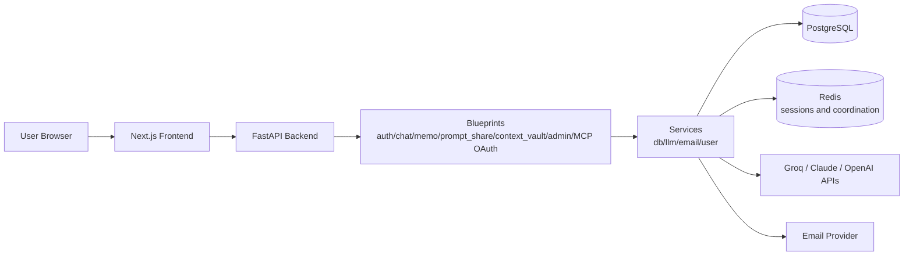
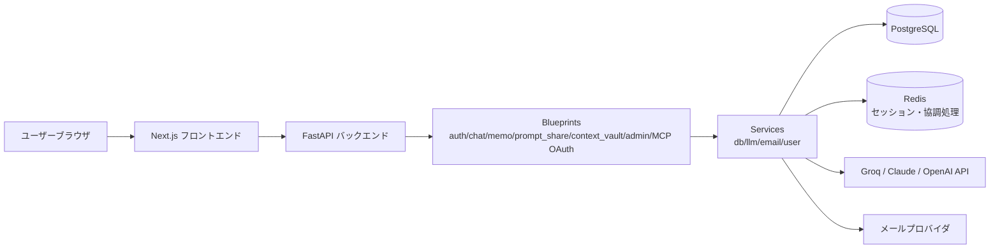

> 一番下に日本語版もあります

# ChatCore-AI


**🚀 Live Demo: [https://chatcore-ai.com/](https://chatcore-ai.com/)**

## UI Preview


## 🎬 Demo Videos

Click a thumbnail to open the video on YouTube.

<p align="center">
  <a href="https://youtu.be/tdPZJdZfeQ0" target="_blank" rel="noopener noreferrer">
    
  </a>
  <br>
  <sub><b>▶ Watch Demo Video</b></sub>
</p>

## Overview
Chat-Core-AI is a FastAPI-based AI chat application with email-based authentication, persistent + ephemeral conversations, and prompt sharing. It integrates with Groq, Anthropic Claude, and OpenAI APIs, uses PostgreSQL for storage, and ships with a Next.js frontend.

## Background

Using AI chat services daily, I kept running into the same friction: writing almost identical prompts over and over — drafting emails, asking for code fixes, requesting detailed explanations on a topic. Re-typing the same instructions every session was tedious and slowed down my workflow.

Chat-Core-AI was built to eliminate that overhead. The core idea is a **Task** system: frequently used prompt patterns are defined once as templates, then launched with a single click and minimal situational input. Beyond personal efficiency, the service also emphasizes **customizability** (tasks and prompts are fully editable per user) and **community prompt sharing**, so useful patterns can be discovered, saved, and reused by others.

## Key Features
- **Email-based authentication** with 6‑digit verification codes
- **Google OAuth** sign-in
- **Streaming LLM responses** via Server-Sent Events (SSE) — all three providers
- **Persistent + ephemeral chat** modes
- **Chat room sharing** via public URLs and SNS link sharing
- **Prompt sharing** with search and public visibility controls
- **Groq / Claude / OpenAI** integrations for LLM responses

## Tech Stack
- **Backend**: Python 3.14, FastAPI, SQLAlchemy 2.0 AsyncEngine/AsyncSession, psycopg 3, Alembic
- **Frontend**: Next.js 16, React 19, TypeScript, Tailwind CSS
- **Database / Cache**: PostgreSQL 18, Redis 7 (server-side sessions and coordination; required for persistent session state)
- **LLM Providers**: Groq, Anthropic Claude, OpenAI
- **Local Dev**: Docker Compose

## Quick Start (Docker Compose)
> This project standardizes local execution on Docker Compose.

> **Note:** This environment does not provide a `python` command. Use `python3` (and `python3 -m pip`) for every Python command in this README.

```sh
# 1) Clone the repository
git clone https://github.com/kota-kawa/ChatCore-AI.git
cd ChatCore-AI

# 2) Create a .env file with required environment variables
cp .env.example .env

# 3) Build and run
docker-compose up --build
```

- Frontend: `http://localhost:3000`
- API: `http://localhost:5004`
- When running behind a reverse proxy, set `TRUSTED_PROXY_IPS` to the proxy IPs/CIDRs that may supply `X-Forwarded-For`.

## Database Migrations (Alembic)
Schema management is unified on Alembic. In development (`FASTAPI_ENV=development`), the app entrypoint waits for PostgreSQL and runs `alembic upgrade head` before starting the API. Production Blue/Green deployment runs migrations explicitly before starting the target color; production app containers skip automatic startup migrations. No separate `init.sql` bootstrap is required or used.

For existing environments, you can also apply DB changes manually:

```sh
# Install dependencies first
python3 -m pip install -r requirements.txt

# Apply all migrations
alembic upgrade head
```

- Current default task definitions are centralized in `frontend/data/default_tasks.json` and seeded on startup; frozen revision catalogs preserve existing users' localized tasks.
- `alembic/versions/` contains incremental migration history.
- `db/performance_indexes.sql` is kept as a direct SQL fallback for index-only updates.
- API schema single source: backend Pydantic models (`services/request_models.py`, `services/response_models.py`) are converted into frontend Zod schemas at `frontend/types/generated/api_schemas.ts` via `python3 scripts/generate_frontend_zod_schemas.py` (or `npm --prefix frontend run generate:api-schemas`).
- Internal structure maps: [`ARCHITECTURE.md`](ARCHITECTURE.md) and [`docs/architecture/`](docs/architecture/).

## Challenges & Solutions

**Redis session safety** — Sessions are stored server-side in Redis, while the browser cookie contains only a signed Redis session reference. If Redis is unavailable or a session write fails, the middleware clears the session cookie instead of copying sensitive session data into a signed cookie; the user can authenticate again after Redis recovers.

**DB connection resilience** — In Docker Compose, the backend container sometimes starts before the database is ready. Solved by SQLAlchemy pool pre-ping, bounded pool acquisition, and the Compose/PostgreSQL healthcheck ordering.

**LLM cost control** — Exposing LLM endpoints directly risked runaway API costs. Solved by implementing a centralized daily quota counter (shared across all users) that short-circuits requests at the service layer before any external API call is made.

**Testing Redis-dependent code in CI** — Redis failure paths are hard to exercise because they trigger only when Redis is down or fails mid-request. Solved by driving the session middleware and Redis coordination code with a mock Redis client that simulates outages and write failures, so secure cookie-clearing and degraded-cache behavior are verified deterministically inside the standard test gate — no live Redis instance required.

## CI/CD & Testing

**Pipeline** (GitHub Actions — runs on every push and pull request):

| Job | What it checks |
|---|---|
| Ruff Lint | Syntax errors and undefined names (fast gate) |
| Unit Tests | 25+ unit tests covering services, auth, chat, rate limiting, security |
| Integration Tests | Route-level endpoint tests against the full ASGI app |
| Coverage Report | Combined unit + integration coverage, uploaded as XML artifact (main push / scheduled runs) |
| Frontend Checks | Import resolution, TypeScript type-check, and logic/component tests via `npm test` |
| Deploy | SSH deploy to production — only runs after all jobs pass on `main` |

- Concurrent runs on the same branch are automatically cancelled to avoid redundant work.
- A scheduled run fires daily at 03:00 UTC to catch dependency regressions.
- Failed deploys trigger an automatic rollback to the previous Git commit.

## Performance & Scalability

- **Connection pooling**: Each FastAPI worker owns one SQLAlchemy `AsyncEngine` with an `AsyncAdaptedQueuePool`, `pool_pre_ping`, `max_overflow=0`, and a bounded acquisition timeout. Set `DB_POOL_MAX_CONN` (or `DB_POOL_MAX_CONN_PRODUCTION` in production). Keep `WEB_CONCURRENCY × DB_POOL_MAX_CONN` below PostgreSQL `max_connections` with deployment headroom; Blue/Green capacity must account for both colors.
- **Redis-backed sessions**: Session data is stored server-side in Redis, enabling stateless horizontal scaling of the application tier when Redis is available. Redis is an operational dependency for persistent authenticated sessions; cache and coordination features have separate degraded behavior.
- **Rate limiting**: Per-day caps on chat LLM API calls and verification email sends, plus a separate monthly support AI agent cap, are enforced at the service layer to protect external API quotas and infrastructure cost.
- **Health endpoints**: `GET /healthz` returns process liveness; `GET /readyz` checks live DB reachability and reports Redis degradation separately. The database is required for readiness, while Redis is required to persist authenticated sessions.
- **Structured logging**: All requests emit JSON logs with `X-Request-ID` correlation IDs, making distributed tracing and incident diagnosis tractable at scale.

## Project Structure
- `app.py`: FastAPI entry point
- `blueprints/`: feature modules (auth, chat, memo, prompt_share, context_vault, admin, MCP OAuth)
- `services/`: shared integrations (DB, LLM, email, user helpers)
- `frontend/public/`: public frontend assets and modular CSS
- `static/`: legacy/runtime static assets
- `alembic/versions/`: PostgreSQL schema migration history
- `frontend/`: Next.js frontend (pages, components, hooks, contexts, and shared libraries)

## Architecture Diagram

```mermaid
flowchart LR
    U[User Browser]
    FE[Next.js Frontend]
    API[FastAPI Backend]
    BP[Blueprints<br/>auth/chat/memo/prompt_share/context_vault/admin/MCP OAuth]
    SV[Services<br/>db/llm/email/user]
    DB[(PostgreSQL)]
    RD[(Redis<br/>sessions and coordination)]
    LLM[Groq / Claude / OpenAI APIs]
    EM[Email Provider]

    U --> FE --> API
    API --> BP --> SV
    SV --> DB
    SV --> RD
    SV --> LLM
    SV --> EM
```

## Design Decisions
- **Why FastAPI (instead of Flask)**: FastAPI gives async-first request handling, type-driven validation, and automatic OpenAPI docs. This reduces API integration friction and keeps backend contracts explicit.
  Trade-off: stricter typing and async patterns add some implementation complexity.
- **Why Redis for session/state**: Sessions are stored server-side and shared across instances, which supports horizontal scaling and operational controls such as centralized invalidation, quota state, and ephemeral state. Redis is required for persistent authenticated sessions, while some cache and coordination paths can degrade independently.
  Trade-off: extra infrastructure and operational overhead, plus re-authentication when Redis cannot persist a session.
- **Why PostgreSQL as the primary datastore**: Core entities (users, chats, prompts, admin data) are relational and consistency-sensitive. PostgreSQL provides strong integrity guarantees plus mature indexing/migration workflows.
- **Why Next.js for frontend**: Next.js supports route-based UI composition and production-ready optimization while allowing incremental migration from legacy static/script assets.
- **Why backend-driven API schemas**: Request/response contracts are authored once in backend Pydantic models and generated into frontend Zod schemas. This removes manual double maintenance and prevents backend/frontend contract drift.

## Engineering Highlights (for reviewers)
- **Secure Redis-backed sessions** (`services/session_middleware.py`): Built a custom ASGI middleware that stores the session body in Redis and keeps only a signed Redis reference in the browser cookie. If Redis cannot persist the session, the middleware clears the cookie rather than exposing sensitive session data in a signed cookie. It also prevents session fixation by rotating the session identifier on login.
- **Streaming LLM responses** (`services/chat_generation.py`): LLM responses are streamed token-by-token via SSE using a background `ChatGenerationJob` thread. Jobs are cancellable, and the completed response is persisted to the database only after the full stream finishes, keeping the HTTP handler thin.
- **Provider-agnostic LLM abstraction** (`services/llm.py`): A single `get_llm_response` / `get_llm_response_stream` interface routes to Groq, Claude, or OpenAI based on model name, with an allowlist that rejects unsupported models before any external call is made.
- **LLM input sanitization**: Conversation messages are scanned for known secret patterns (API keys, OAuth tokens, passwords) using compiled regexes and redacted before forwarding to any LLM provider, preventing accidental secret leakage.
- **CSRF protection** (`services/csrf.py`): Custom header-based CSRF token validation is enforced on all state-changing requests. Tokens are auto-generated per session inside the session middleware, requiring no extra setup per route.

## License
Copyright (c) 2026 Kota Kawagoe

Licensed under the Apache License, Version 2.0 - see the [LICENSE](LICENSE) file for details.

---

<details>
<summary>日本語版 (クリックして展開)</summary>

# Chat-Core-AI


**🚀 ライブデモ: [https://chatcore-ai.com/](https://chatcore-ai.com/)**

## UI Preview


## 🎬 Demo Videos

Click a thumbnail to open the video on YouTube.

<p align="center">
  <a href="https://youtu.be/tdPZJdZfeQ0" target="_blank" rel="noopener noreferrer">
    
  </a>
  <br>
  <sub><b>▶ デモ動画を見る</b></sub>
</p>

## 概要
Chat-Core-AI は FastAPI で構築した AI チャットアプリです。メール認証・永続／エフェメラルチャット・プロンプト共有を備え、Groq・Anthropic Claude・OpenAI API に対応しています。PostgreSQL を採用し、Next.js フロントエンドと連携します。

## 制作背景

ChatGPT などの AI チャットサービスを日常的に使うなかで、「〇〇のメールを作成して」「このコードを修正して」「〇〇について詳しく教えて」など、毎回ほぼ同じ内容を入力し直す手間を強く感じていました。反復的な作業を毎回一から書くのは非効率で、本来集中すべき作業の妨げになっていました。

この課題を解消するために Chat-Core-AI を制作しました。よく使う指示パターンをあらかじめ **タスク** として登録しておくことで、最小限の状況入力とワンクリックで AI との対話を即座に開始できます。また、タスクやプロンプトを自分好みに編集・並び替えできる **高いカスタマイズ性** と、便利なプロンプトをコミュニティで発見・保存・再利用できる **プロンプト共有** 機能も重視して設計しています。

## 主な機能
- **メール認証**（6 桁コード）
- **Google OAuth** ログイン
- **LLM ストリーミング応答**（SSE 経由 — 全プロバイダ対応）
- **永続／エフェメラル**のチャット
- **チャット共有リンク**（URL/SNS 共有）
- **プロンプト共有**（公開・検索）
- **Groq / Claude / OpenAI 連携**

## 技術スタック
- **Backend**: Python 3.14, FastAPI, SQLAlchemy 2.0 AsyncEngine/AsyncSession, psycopg 3, Alembic
- **Frontend**: Next.js 16, React 19, TypeScript, Tailwind CSS
- **Database / Cache**: PostgreSQL 18, Redis 7（セッション・協調処理に使用。認証セッションの永続化には必須）
- **LLM Providers**: Groq, Anthropic Claude, OpenAI
- **Local Dev**: Docker Compose

## 実行方法（Docker Compose）
> 実行方法は Docker Compose に統一しています。

> **注意:** この環境には `python` コマンドがありません。本 README の Python コマンドはすべて `python3`（および `python3 -m pip`）を使用してください。

```sh
# 1) リポジトリを取得
git clone https://github.com/kota-kawa/ChatCore-AI.git
cd ChatCore-AI

# 2) 環境変数を設定
cp .env.example .env
# メール送信は Resend を使用します。
# RESEND_API_KEY と、Resend で検証済みドメインの RESEND_FROM_ADDRESS を設定してください。

# 3) ビルド＆起動
docker-compose up --build
```

- フロントエンド: `http://localhost:3000`
- API: `http://localhost:5004`
- リバースプロキシ配下で動かす場合は、`X-Forwarded-For` を渡せるプロキシの IP/CIDR を `TRUSTED_PROXY_IPS` に設定してください。

## データベースマイグレーション（Alembic）
スキーマ管理は Alembic に統一しています。開発環境（`FASTAPI_ENV=development`）では、コンテナのエントリーポイントが PostgreSQL の起動を待ってから `alembic upgrade head` を実行し、APIを起動します。本番のBlue/Greenデプロイでは、対象色の起動前にデプロイスクリプトがmigrationを明示的に実行し、本番コンテナ起動時の自動migrationはスキップします。`init.sql` のような別系統の初期化スクリプトは使いません。

既存環境へ手動で適用する場合は次を実行してください。

```sh
# 先に依存関係をインストール
python3 -m pip install -r requirements.txt

# 全マイグレーションを適用
alembic upgrade head
```

- 現行の既定タスク定義は `frontend/data/default_tasks.json` を単一ソースとして起動時に投入し、既存ユーザー向けのローカライズは凍結した旧版カタログで維持
- `alembic/versions/`: 段階的な変更履歴
- `db/performance_indexes.sql`: インデックスのみを直接適用するフォールバックSQL
- APIスキーマの単一ソース: バックエンドPydantic（`services/request_models.py`, `services/response_models.py`）を `python3 scripts/generate_frontend_zod_schemas.py`（または `npm --prefix frontend run generate:api-schemas`）でフロントエンドZod（`frontend/types/generated/api_schemas.ts`）へ生成
- 内部構成の詳細: [`ARCHITECTURE.md`](ARCHITECTURE.md) と [`docs/architecture/`](docs/architecture/)

## 課題と解決策（Challenges & Solutions）

**Redisセッションの安全な失敗** — セッション本体はRedisに保存し、ブラウザCookieには署名済みのRedis参照IDだけを保持します。Redisがダウンまたはセッション保存中にエラーが発生した場合、機密情報を署名付きCookieへ退避せず、ミドルウェアがセッションCookieを消去します。Redis復旧後は再認証が必要です。

**DBコネクションの耐障害性** — Docker ComposeではバックエンドコンテナがDBより先に起動してしまうことがありました。コネクションプールが `db`・`localhost`・`127.0.0.1` など複数ホストを順番に試し、接続確認が取れた最初のホストを採用する設計で解決しています。

**LLMコスト制御** — LLMエンドポイントを直接公開すると外部API費用が青天井になるリスクがあります。全ユーザー合算の日次クォータカウンターをサービス層で一元管理し、外部API呼び出しの前段階でリクエストを遮断することで対処しています。

**CI環境でのRedis依存テスト** — Redis障害経路はRedisダウン時やリクエスト中の書き込み失敗時にしか発動せず、そのままでは再現が困難でした。障害や書き込み失敗を模擬するモックRedisクライアントで駆動することで、安全なCookie消去とキャッシュ劣化の挙動を実Redisなしで決定論的に検証しています。

## CI/CDとテスト（CI/CD & Testing）

**パイプライン**（GitHub Actions — 全push・PRで実行）:

| ジョブ | 確認内容 |
|---|---|
| Ruff Lint | 構文エラー・未定義名の即時検出（高速ゲート） |
| Unit Tests | サービス層・認証・チャット・レート制限・セキュリティなど25件以上 |
| Integration Tests | 実際のASGIアプリに対するルートレベルのエンドポイントテスト |
| Coverage Report | ユニット＋統合テストの合算カバレッジをXMLアーティファクトとして保存（mainへのpush・スケジュール実行時） |
| Frontend Checks | import解決、TypeScript型チェック、`npm test`によるロジック／コンポーネントテスト |
| Deploy | 全ジョブ通過後にSSHで本番デプロイ（mainのpush時のみ） |

- 同一ブランチで並走するジョブは自動キャンセルして無駄な実行を排除。
- 毎日03:00 UTCにスケジュール実行し、依存パッケージの非互換を継続的に検知。
- デプロイ失敗時は直前のGitコミットへ自動ロールバック。

## パフォーマンスとスケーラビリティ（Performance & Scalability）

- **コネクションプール**: FastAPIワーカーごとにSQLAlchemy `AsyncEngine`を1つだけ生成し、`AsyncSession`をユースケース単位で作成します。`DB_POOL_MAX_CONN`（本番は`DB_POOL_MAX_CONN_PRODUCTION`）で上限を設定し、`WEB_CONCURRENCY × DB_POOL_MAX_CONN`がPostgreSQLの`max_connections`と予備枠を超えないようにします。Blue/Green同時稼働時は両色分を見積もります。
- **Redisセッション**: セッション本体をRedisに保存し、アプリ層をステートレスに保つことで水平スケールに対応。認証セッションの永続化にはRedisが必要で、キャッシュや協調処理は用途ごとに劣化動作します。
- **レート制限**: LLM API呼び出し・認証メール送信の日次上限に加え、ゲストチャット回数制限（`GUEST_CHAT_DAILY_LIMIT`）もサービス層のサーバー側カウンタで一元管理し、Cookie改ざんによる回避や外部APIコスト増大を防止。
- **ヘルスエンドポイント**: `GET /healthz` でプロセス生存確認、`GET /readyz` でDB到達性とRedisの劣化状態を分けて返し、ロードバランサーのヘルスチェックに対応。DBはreadinessに必須で、Redisは認証セッションの永続化に必須。
- **構造化ログ**: 全リクエストに `X-Request-ID` 相関IDを付与したJSONログを出力し、障害時のトレーサビリティを確保。

## ディレクトリ構成
- `app.py`: FastAPI エントリーポイント
- `blueprints/`: 機能別モジュール（auth, chat, memo, prompt_share, context_vault, admin, MCP OAuth）
- `services/`: DB/LLM/メールなど共通処理
- `frontend/public/`: フロントエンドの公開アセットとモジュール単位のCSS
- `static/`: レガシー／ランタイム用の静的アセット
- `alembic/versions/`: PostgreSQL スキーマ変更履歴
- `frontend/`: Next.js フロントエンド（pages、components、hooks、contexts、共通ライブラリ）

## アーキテクチャ図

```mermaid
flowchart LR
    U[ユーザーブラウザ]
    FE[Next.js フロントエンド]
    API[FastAPI バックエンド]
    BP[Blueprints<br/>auth/chat/memo/prompt_share/context_vault/admin/MCP OAuth]
    SV[Services<br/>db/llm/email/user]
    DB[(PostgreSQL)]
    RD[(Redis<br/>セッション・協調処理)]
    LLM[Groq / Claude / OpenAI API]
    EM[メールプロバイダ]

    U --> FE --> API
    API --> BP --> SV
    SV --> DB
    SV --> RD
    SV --> LLM
    SV --> EM
```

## 技術的な意思決定（Design Decisions）
- **なぜ FastAPI（Flask ではなく）を選んだか**: 非同期処理、型ヒントベースのバリデーション、自動生成される OpenAPI ドキュメントを活用し、API 連携と仕様の明確化を優先したためです。
  トレードオフ: 型定義と async の実装負荷は増えます。
- **なぜ Redis をセッション/状態管理に使うか**: セッションをサーバー側で一元管理でき、複数インスタンス構成でも共有しやすく、失効制御やクォータ/エフェメラル状態の運用がしやすくなります。認証セッションの永続化にはRedisが必要ですが、キャッシュや協調処理は用途ごとに劣化できます。
  トレードオフ: 追加インフラの運用コストと、Redis障害時の再認証が発生します。
- **なぜ PostgreSQL を主データストアにしたか**: ユーザー・チャット・プロンプト・管理データは関係性と整合性が重要なため、整合性保証・インデックス・マイグレーションが成熟した PostgreSQL を採用しています。
- **なぜ Next.js を採用したか**: ルート単位でUIを構成しつつ本番最適化を行え、既存の静的アセット/スクリプト構成から段階的に移行しやすいためです。
- **なぜ API スキーマをバックエンド主導にしたか**: リクエスト/レスポンス契約をバックエンドPydanticに集約し、フロントエンドZodは生成で同期します。手書き二重管理をなくし、契約ドリフトを防ぐためです。

## レビュー観点の強み
- **安全なRedisセッションミドルウェア** (`services/session_middleware.py`): セッション本体をRedisに保存し、ブラウザCookieには署名済みのRedis参照IDだけを保持するカスタムASGIミドルウェア。Redis障害時は機密情報をCookieへ退避せず、Cookieを消去して再認証へ誘導。ログイン時のセッションID再発行によるセッション固定攻撃対策も実装。
- **LLM ストリーミング応答** (`services/chat_generation.py`): バックグラウンドスレッド上の `ChatGenerationJob` がトークン逐次生成し SSE で配信。ジョブはキャンセル可能で、レスポンス全体の受信完了後にのみ DB 保存を行うことで HTTP ハンドラを薄く保つ設計。
- **プロバイダ非依存 LLM 抽象層** (`services/llm.py`): `get_llm_response` / `get_llm_response_stream` の単一インターフェースがモデル名でルーティング。許可リスト外のモデルは外部 API 呼び出し前に即時拒否。
- **LLM 入力サニタイズ**: API キー・OAuth トークン・パスワードなどの秘密情報パターンをコンパイル済み正規表現でスキャンし、外部 LLM プロバイダへ送信する前に自動的に伏せ字化。意図しない秘密漏洩を防止。
- **CSRF 対策** (`services/csrf.py`): ヘッダーベースの CSRF トークン検証をすべての状態変更リクエストに適用。トークンはセッションミドルウェア内でセッションごとに自動生成されるため、ルートごとの追加設定不要。

## ライセンス
Copyright (c) 2026 Kota Kawagoe

Apache License, Version 2.0 の下でライセンスされています。詳細は [LICENSE](LICENSE) を参照してください。

</details>
