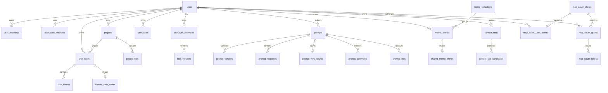

# Data model overview

PostgreSQL の構造は `alembic/versions/` の適用後状態が正本です。ここでは機能間の関係を示し、全列・全インデックスを複製しません。SQLAlchemyモデルの登録先は`services.models.Base.metadata`で、Alembicの`target_metadata`と共有します。DBアクセスは`AsyncSession`をRepositoryへ渡し、通常のCRUDはORM、複雑検索・JSONB・pgvector・PostgreSQL固有処理はSQLAlchemy Coreまたは`text()`で実装します。

## エンティティの関係

## 機能別の主要テーブル

| 領域 | 主要テーブル | 関係・注意点 |
| --- | --- | --- |
| Identity | `users`, `user_passkeys`, `user_auth_providers` | ほとんどのユーザー所有データは `users.id` に紐づく。認証プロバイダー情報の正本は`user_auth_providers`のみで、`services/repositories/auth_identity_repository.py`がメール・Google・Passkey向けの永続化契約を所有する。`users` 行そのもの（プロフィール、サインイン用メール、`preferred_locale`）とアカウント削除は `services/repositories/user_repository.py` が所有する。 |
| Chat | `chat_rooms`, `chat_history`, `shared_chat_rooms`, `chat_room_summaries`, `memory_facts`, `user_skills` | 永続化境界は機能別に分かれ、ルーム・履歴・分岐・共有・ルーム内メモリを `services/repositories/chat_repository.py` が、`user_skills` と `users.generative_ui_skill_enabled` を `services/repositories/user_skill_repository.py` が所有する。部屋削除は履歴・要約・ルーム内メモリへ cascade する。`chat_rooms.mode` は `normal`／`temporary`。`chat_rooms.last_activity_at` はメッセージ保存時に更新され、履歴一覧の新着順とカーソル境界の正本になる。`shared_chat_rooms.revoked_at`／`expires_at` は共有リンクのライフサイクルで、どちらも NULL の行だけが公開読み取りの対象になる。`user_skills` はユーザーがトップページで登録する再利用指示で、有効行だけがチャット生成時の追加システム文脈になる。生成UIはコード定義の削除・編集不可なデフォルトSkillであり、ユーザーごとのON/OFFだけを `users.generative_ui_skill_enabled` に保存するため、`user_skills` の件数上限には含めない。共有 Skill から追加した行は `source_prompt_id` で出典と追加済み状態を追跡し、共有元が削除された場合も Skill 本体は残して参照だけを NULL にする。 |
| Projects | `projects`, `project_files` | プロジェクトはユーザー所有。チャット部屋から project を参照する。`services/repositories/project_repository.py` が `projects` と `chat_rooms.project_id` の所属を所有し、部屋の所有者確認は `services/repositories/chat_room_access.py` を共有する。 |
| Tasks | `task_with_examples`, `task_versions` | `services/repositories/task_repository.py` が所有する。system task とユーザー task を同じ主テーブルで扱い、論理削除・revision・source prompt を追加情報として持つ。version 行は旧列に加えて、現在の task 全体を `snapshot` JSONB に保存する。 |
| Prompt sharing | `prompts`, `guest_prompt_submissions`, `prompt_versions`, `prompt_view_counts`, `prompt_list_entries`, `prompt_likes`, `prompt_comments`, `prompt_comment_reports`, `prompt_resources` | 公開プロンプト、ゲスト投稿のCookie/IPハッシュと引継ぎ状態、バージョン、ビュー数、いいね、コメント、Skill resources を分離する。未引継ぎゲストの `prompts.user_id` と `prompt_versions.user_id` は NULL を許容し、version 行は `snapshot` JSONB に現在の prompt 全体を保存する。ビュー数は編集日時・履歴を更新しない専用カウンターで保持し、画像本体は DB ではなく attachment storage 境界へ委譲する。 |
| Memo | `memo_collections`, `memo_entries`, `shared_memo_entries` | メモ本体、コレクション、期限・撤回可能な共有トークンを分離する。embedding はメモ検索用の補助情報で、`embedding_status` が `pending`／`ready` の再生成状態を表す。 |
| Context vault | `context_facts`, `context_fact_candidates` | active/deprecated の事実と、承認前の抽出候補を分ける。候補は承認後に事実へ紐づく。`context_facts.embedding_status` で vector の生成待ちを監視する。 |
| MCP OAuth | `mcp_oauth_clients`, `mcp_oauth_user_clients`, `mcp_oauth_grants`, `mcp_oauth_authorization_codes`, `mcp_oauth_tokens` | client、ユーザー別 client 表示、grant、短命 authorization code、access/refresh token を分離する。token の保存値は digest 化される。 |

共有リンクの公開パス、token生成設定、衝突判定、期限・撤回状態のシリアライズは共有サービスで再利用します。ただし `shared_chat_rooms` と `shared_memo_entries` の保存境界・ライフサイクルは統合せず、公開プロンプトは引き続き `prompts.id` と soft-delete を正本にします。

`prompt_list_entries_legacy` と `prompt_list_entries_v2` は migration の変換過程で現れる名前であり、現行機能の所有境界を判断する際は現在の `prompt_list_entries` と migration head を確認します。

## 永続化されない状態

- セッション本体は Redis の `session:<id>`。Cookie は署名済み参照 ID のみです。
- Google OAuth の短命トランザクションは Redis の `google_oauth_transaction:<state>` に保存し、stateを専用HttpOnly Cookieと照合してコールバックで一度だけ消費します。OAuth状態は一般セッションへ保存しません。
- メール認証の短命トランザクションは Redis の `email_auth_transaction:<id>` に保存し、コードdigest、ユーザー、flow、試行回数を専用HttpOnly Cookieと紐づけます。ログイン・新規登録の認証コードは一般セッションへ保存せず、Redisの `WATCH`／`MULTI`／`EXEC` による楽観的排他で検証・試行回数更新・消費を行います。
- キャッシュ、日次・月次クォータ、single-flight lock、チャット生成のイベント協調は Redis を使います。
- プロンプト共有画像の表示用・カード用 WebP は `PROMPT_SHARE_UPLOAD_DIR` の永続 Docker volume に保存されます。DB は添付 descriptor と参照関係の source of truth です。
- アバター画像は `AVATAR_UPLOAD_DIR` の永続 Docker volume に保存し、`/api/user/avatars/<filename>` としてアプリが配信します。`users.avatar_url` が source of truth で、旧 `/static/uploads/<filename>` は読み出し時に `services/avatar_storage.py` の `normalize_avatar_url` が現行URLへ読み替えます。既定アイコン `/static/user-icon.png` は frontend の静的アセットです。
- エフェメラルチャットの削除、添付ファイルとアバターの orphan cleanup、起動時 seed は `app.py` の lifespan／バックグラウンド処理から実行されます。

## スキーマ変更を追う場所

1. `alembic/versions/` で対象テーブルの作成・変更 revision を検索する。
2. `services/repositories/` または機能内 repository と、所有者確認を行う route/service を確認する。
3. API の形状も変わる場合は Pydantic model と生成 Zod schema を確認する。
4. `alembic current` と `alembic heads` で適用状態を確認し、既存 revision は編集しない。
