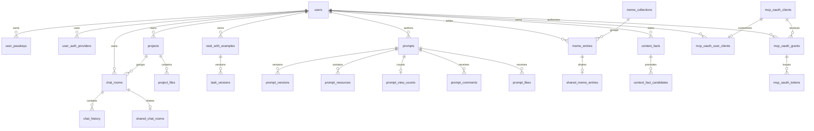

# Data model overview

PostgreSQL の構造は `alembic/versions/` の適用後状態が正本です。ここでは機能間の関係を示し、全列・全インデックスを複製しません。DB アクセスは `psycopg2.ThreadedConnectionPool` と raw SQL を基本とし、SQLAlchemy ORM のモデル層はありません。

## エンティティの関係

## 機能別の主要テーブル

| 領域 | 主要テーブル | 関係・注意点 |
| --- | --- | --- |
| Identity | `users`, `user_passkeys`, `user_auth_providers` | ほとんどのユーザー所有データは `users.id` に紐づく。言語設定は `users.preferred_locale` に保存される。 |
| Chat | `chat_rooms`, `chat_history`, `shared_chat_rooms`, `chat_room_summaries`, `memory_facts` | 部屋削除は履歴・要約・ルーム内メモリへ cascade する。`chat_rooms.mode` は `normal`／`temporary`。 |
| Projects | `projects`, `project_files` | プロジェクトはユーザー所有。チャット部屋から project を参照する。 |
| Tasks | `task_with_examples`, `task_versions` | system task とユーザー task を同じ主テーブルで扱い、論理削除・revision・source prompt を追加情報として持つ。 |
| Prompt sharing | `prompts`, `guest_prompt_submissions`, `prompt_versions`, `prompt_view_counts`, `prompt_list_entries`, `prompt_likes`, `prompt_comments`, `prompt_comment_reports`, `prompt_resources` | 公開プロンプト、ゲスト投稿のCookie/IPハッシュと引継ぎ状態、バージョン、ビュー数、いいね、コメント、Skill resources を分離する。ビュー数は編集日時・履歴を更新しない専用カウンターで保持し、画像本体は DB ではなく attachment storage 境界へ委譲する。 |
| Memo | `memo_collections`, `memo_entries`, `shared_memo_entries` | メモ本体、コレクション、期限・撤回可能な共有トークンを分離する。embedding はメモ検索用の補助情報。 |
| Context vault | `context_facts`, `context_fact_candidates` | active/deprecated の事実と、承認前の抽出候補を分ける。候補は承認後に事実へ紐づく。 |
| MCP OAuth | `mcp_oauth_clients`, `mcp_oauth_user_clients`, `mcp_oauth_grants`, `mcp_oauth_authorization_codes`, `mcp_oauth_tokens` | client、ユーザー別 client 表示、grant、短命 authorization code、access/refresh token を分離する。token の保存値は digest 化される。 |

`prompt_list_entries_legacy` と `prompt_list_entries_v2` は migration の変換過程で現れる名前であり、現行機能の所有境界を判断する際は現在の `prompt_list_entries` と migration head を確認します。

## 永続化されない状態

- セッション本体は Redis の `session:<id>`。Cookie は署名済み参照 ID のみです。
- キャッシュ、日次・月次クォータ、single-flight lock、チャット生成のイベント協調は Redis を使います。
- プロンプト共有画像の表示用・カード用 WebP は `PROMPT_SHARE_UPLOAD_DIR` の永続 Docker volume に保存されます。DB は添付 descriptor と参照関係の source of truth です。
- エフェメラルチャットの削除、添付ファイルの orphan cleanup、起動時 seed は `app.py` の lifespan／バックグラウンド処理から実行されます。

## スキーマ変更を追う場所

1. `alembic/versions/` で対象テーブルの作成・変更 revision を検索する。
2. `services/repositories/` または機能内 repository と、所有者確認を行う route/service を確認する。
3. API の形状も変わる場合は Pydantic model と生成 Zod schema を確認する。
4. `alembic current` と `alembic heads` で適用状態を確認し、既存 revision は編集しない。
