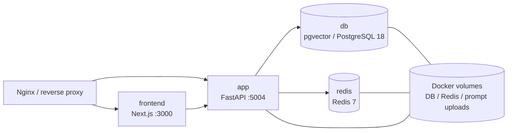

# Deployment and operations topology

## Docker Compose のサービス



| Service | 役割 | 開発 Compose の接続 | 永続化 |
| --- | --- | --- | --- |
| `app` | FastAPI、背景ジョブ、migration entrypoint | ホスト `127.0.0.1:5004`、Compose 内 `app:5004` | prompt upload volume |
| `frontend` | Next.js Pages Router | ホスト `127.0.0.1:3000`、Backend URL は `http://app:5004` | なし |
| `db` | `pgvector/pgvector:0.8.5-pg18` | Compose 内 `db:5432` | `db_data_pg18` |
| `redis` | セッション、cache、worker 協調 | Compose 内 `redis:6379`、ホスト debug は loopback `6380` | `redis_data` |
| `nginx_bootstrap` | Nginx の active upstream ファイル生成 | blue／green のポートを選択 | upstream 設定 bind mount |

外部へ直接公開するのは reverse proxy であり、Compose の app/frontend/Redis のポートは loopback bind です。Redis をインターネットへ公開しません。

## 起動順序

### 開発

`docker-compose.local.yml` は `FASTAPI_ENV=development` と localhost の URL を上書きします。

1. `db` が healthcheck（`pg_isready`）を通過する。
2. `app` の entrypoint が `wait-for-it.sh db:5432` を実行する。
3. development の場合、entrypoint が `alembic upgrade head` を実行する。
4. Uvicorn が FastAPI を起動し、`/readyz` が DB の到達性を確認する。
5. `frontend` は app の healthcheck 通過後に起動する。

### 本番 Blue/Green

`deploy/docker-compose.bluegreen.yml` は共通の `db`／`redis` と、blue／green の app・frontend を持ちます。

1. `deploy/blue_green_deploy.sh` が非アクティブ色を決定する。
2. 必要な PostgreSQL／upload volume の移行を行う。
3. 対象色の app で `scripts/check_migration_safety.py` を実行し、旧色との互換性を壊す migration が混入していないことを確認する。
4. 対象色の app を使って `alembic upgrade head` を明示実行する。
5. 対象色の app、frontend の healthcheck を待つ。
6. Nginx の active upstream を対象色へ切り替え、旧色を停止する。
7. トラフィック切り替え後に embedding の未処理件数を出力する。
8. 必要な場合のみ `POST_DEPLOY_CLEANUP_COMMAND` を Contract 段階として実行する。

本番コンテナは `FASTAPI_ENV=production` のため、起動時に自動 migration を実行しません。これにより、migration の適用とトラフィック切り替えをデプロイ手順で制御します。

`MIGRATION_SAFETY_BASELINE`（既定値 `20260824_03`）より後の revision は、
`DROP COLUMN`、`DELETE FROM`、`SET NOT NULL`、一意 index の追加などを
pre-deploy の upgrade に含められません。データ backfill が必要な場合は、
監査済みであることを migration 内に明示し、旧色が停止した後の Contract 手順へ
分離してください。Contract 用のコマンドは環境変数から明示的に設定し、通常の
`alembic upgrade head` に破壊的変更を隠さないでください。

## Embedding の復旧と監視

`memo_entries.embedding_status` と `context_facts.embedding_status` は、
`pending`（未生成・再生成待ち）または `ready`（現在の vector が保存済み）を表します。
旧 migration が不正な JSON／次元の embedding を NULL として無視した行も、
`scripts/backfill_embeddings.py --dry-run` で件数を確認できます。

```sh
python3 scripts/backfill_embeddings.py --dry-run
python3 scripts/backfill_embeddings.py --fail-on-pending
python3 scripts/backfill_embeddings.py --target memos --limit 500
```

本番デプロイ後には dry-run の件数を自動出力します。provider が復旧した後に
backfill を実行し、`--fail-on-pending` が成功することを運用完了条件にします。

## スケール時の制約

- Uvicorn worker ごとに DB pool が作られます。`WEB_CONCURRENCY * DB_POOL_MAX_CONN`（Blue/Green の同時稼働中は両色分）が PostgreSQL の `max_connections` を超えないようにします。
- セッション、生成ジョブのロック・イベント、クォータを Redis に外出しすることで複数 worker／複数色を協調させます。
- prompt upload volume は同一ホストの blue／green が共有します。マルチホスト化には object storage/CDN の実装が必要です。
- `app` の `/healthz` はプロセス生存、`/readyz` は依存先を含む準備状態、frontend の `/api/healthz` は Next.js 側の healthcheck です。

## 運用時に確認するファイル

- Compose のサービス・環境変数・volume: `docker-compose.yml`
- 開発上書き: `docker-compose.local.yml`
- Blue/Green 定義: `deploy/docker-compose.bluegreen.yml`
- migration と起動順: `docker/app-entrypoint.sh`, `deploy/blue_green_deploy.sh`
- Nginx の upstream: `deploy/chatcore-ai.conf`, `nginx_bootstrap` の出力先
- connection pool: `services/db.py`
- Redis cooldown／degraded behavior: `services/cache.py`
